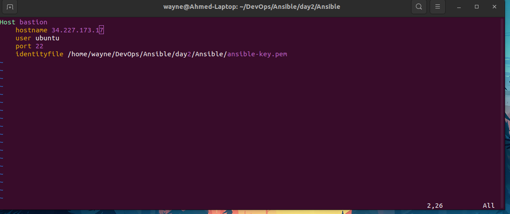
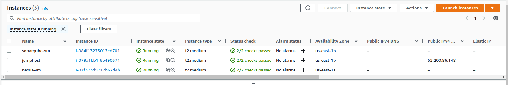
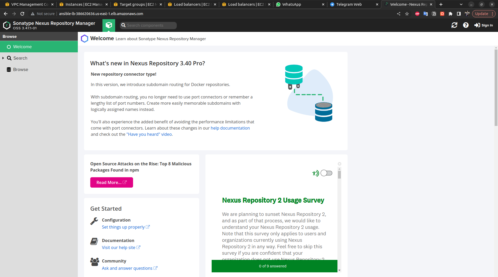
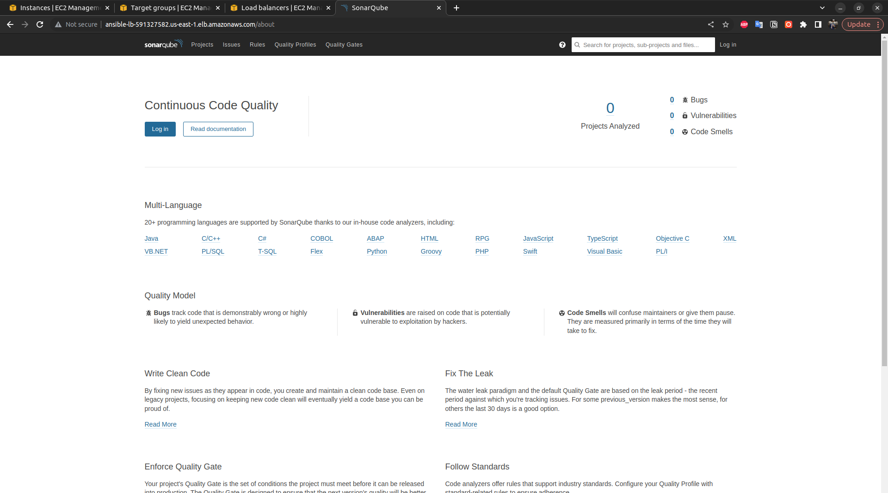

# How to SSH to the private EC2s

vi to the ssh config file 
```bash 
 vi ~/.ssh/config
```
then add this info 

```bash
Host bastion
    hostname 52.200.86.148 
    user ubuntu
    port 22
    identityfile day2/Ansible/ansible-key.pem
```
 


Create the roles for Nexus:
```bash
ansible-galaxy init roles/nexus
```
Create the roles for SonarQube:
```bash
ansible-galaxy init roles/SonarQube
```
Run Ansible command to start the Playbook:
```bash
 ansible-playbook playbook.yml -i inventory.txt
```
### EC2s Used for this lab 
#### As seen in the Image there's 2 private EC2s for the SonarQube & Nexus and 1 public to act as jumbhost

---
## This is Nexus Running 
 

## This is SonarQube Running 

 
